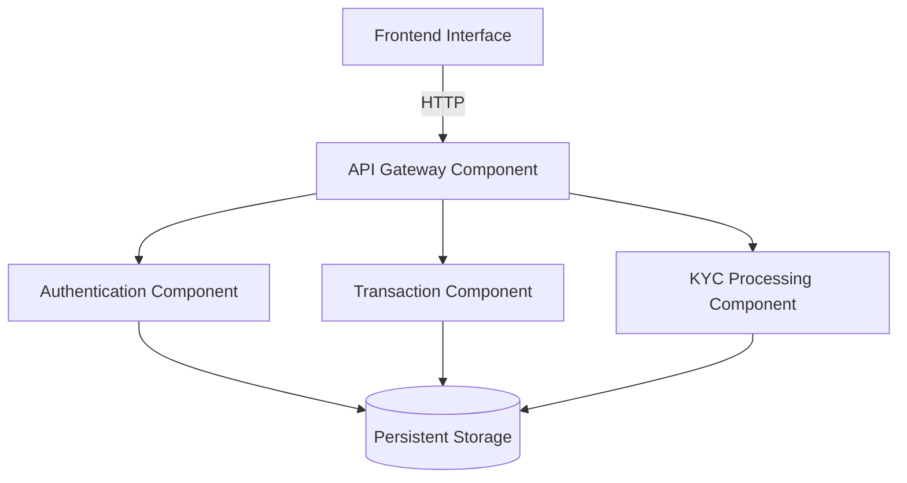
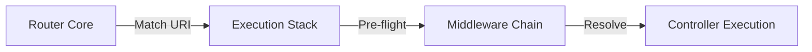

# Component Diagrams

## Table of Contents
1. [Core Components](#core-components)
2. [Router Component](#router-component)

## Core Components

```mermaid
graph TD
    UI[Frontend Interface]
    API[API Gateway Component]
    Auth[Authentication Component]
    Tx[Transaction Component]
    KYC[KYC Processing Component]
    DB[(Persistent Storage)]
    
    UI -->|HTTP| API
    API --> Auth
    API --> Tx
    API --> KYC
    Auth --> DB
    Tx --> DB
    KYC --> DB
```

## Router Component

```mermaid
graph LR
    R[Router Core] -->|Match URI| E[Execution Stack]
    E -->|Pre-flight| M[Middleware Chain]
    M -->|Resolve| C[Controller Execution]
```