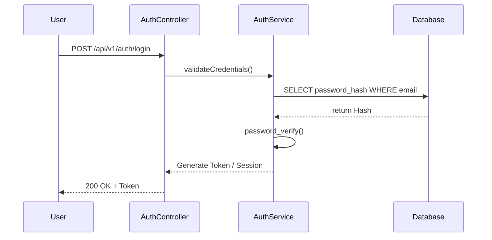
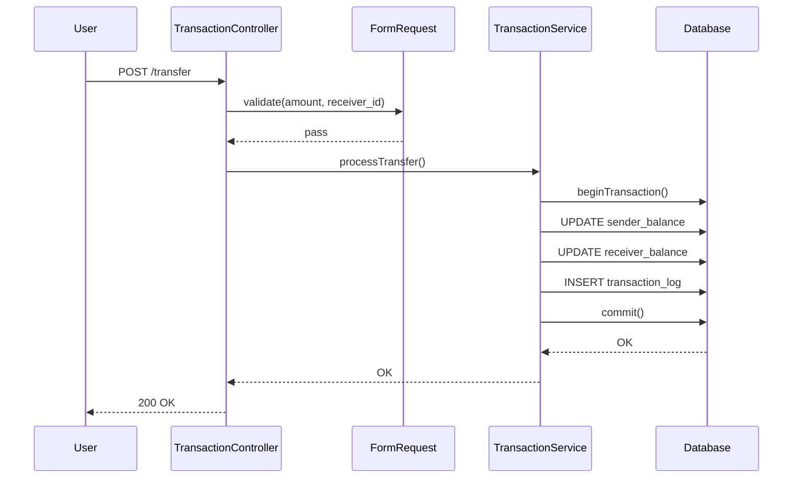

# Sequence Diagrams

## Table of Contents
1. [Authentication Flow](#authentication-flow)
2. [Funds Transfer Flow](#funds-transfer-flow)

## Authentication Flow

```mermaid
sequenceDiagram
    participant U as User
    participant A as AuthController
    participant S as AuthService
    participant D as Database
    
    U->>A: POST /api/v1/auth/login
    A->>S: validateCredentials()
    S->>D: SELECT password_hash WHERE email
    D-->>S: return Hash
    S->>S: password_verify()
    S-->>A: Generate Token / Session
    A-->>U: 200 OK + Token
```

## Funds Transfer Flow

```mermaid
sequenceDiagram
    participant U as User
    participant C as TransactionController
    participant V as FormRequest
    participant S as TransactionService
    participant DB as Database
    
    U->>C: POST /transfer
    C->>V: validate(amount, receiver_id)
    V-->>C: pass
    C->>S: processTransfer()
    S->>DB: beginTransaction()
    S->>DB: UPDATE sender_balance
    S->>DB: UPDATE receiver_balance
    S->>DB: INSERT transaction_log
    S->>DB: commit()
    DB-->>S: OK
    S-->>C: OK
    C-->>U: 200 OK
```